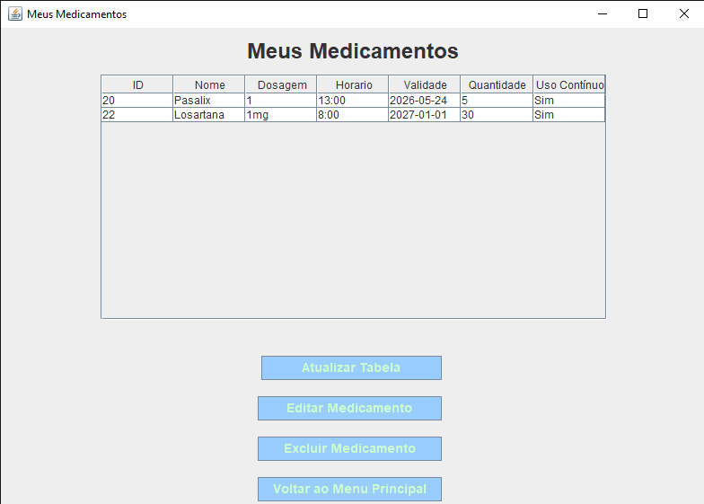
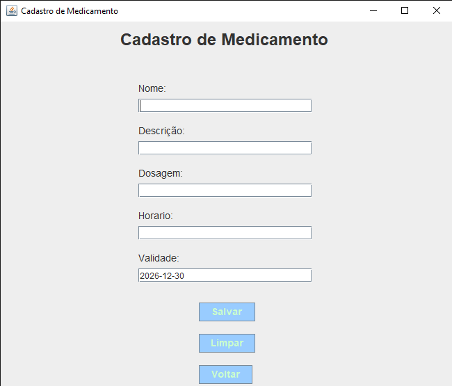
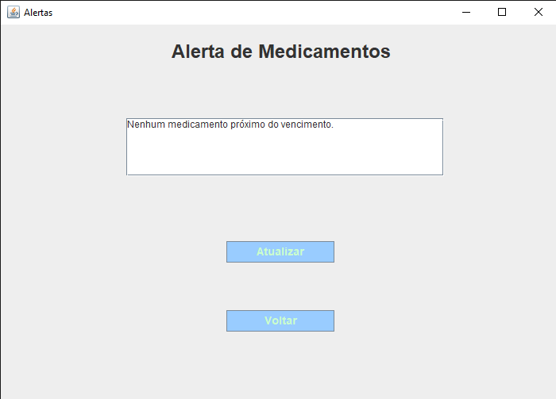
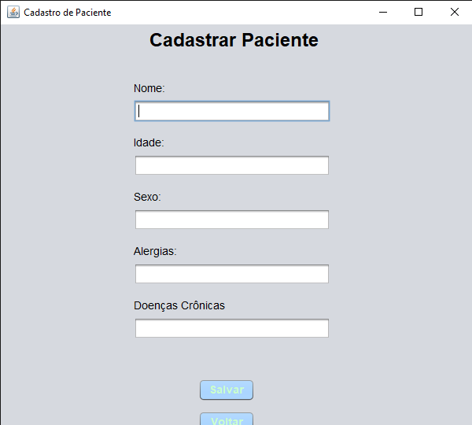
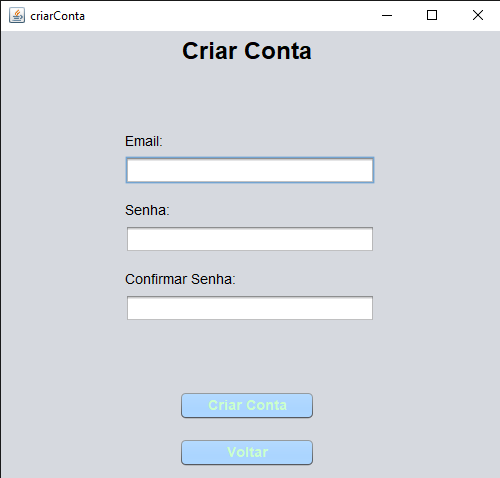

# MedControl

Sistema desktop acadêmico para auxiliar no gerenciamento de medicamentos, horários, dosagens, estoque e validade. O projeto foi desenvolvido pelo grupo **Code4Care** na disciplina UPX 2 do curso de Análise e Desenvolvimento de Sistemas da FACENS.

> Este repositório registra a versão entregue no projeto acadêmico. O código foi reorganizado para consulta e portfólio. O material original não continha toda a estrutura do projeto NetBeans, mas o histórico SQL fornecido pela equipe permitiu preparar um script limpo de criação do banco.

## Funcionalidades implementadas

- criação de conta e autenticação;
- cadastro e edição dos dados do paciente;
- cadastro, listagem, edição e exclusão de medicamentos;
- controle de dosagem, horário, quantidade e uso contínuo;
- alertas de validade e estoque;
- histórico diário de medicamentos tomados ou pendentes;
- separação dos registros por usuário.

## Telas do sistema

### Meus medicamentos



### Cadastro de medicamento



### Alertas



### Cadastro de paciente



### Criar conta



## Tecnologias

- Java 24.0.2
- Java Swing
- NetBeans 27
- Microsoft SQL Server
- JDBC / Microsoft JDBC Driver for SQL Server
- Figma, Canva e Trello

## Estrutura

```text
src/
└── main/java/
    ├── DAO/       # acesso a medicamentos e histórico
    ├── dao/       # acesso a contas e usuários
    ├── Model/     # entidades e sessão
    ├── Telas/     # interfaces Swing e formulários NetBeans
    ├── conexao/   # conexão com SQL Server
    └── Sistema/   # protótipo inicial em console
docs/
├── images/        # capturas reais da aplicação desktop
└── original/      # artigo e apresentação acadêmica
database/
└── schema.sql      # criação limpa do banco utilizado pela aplicação
```

## Configuração original

A classe `Conexao` aponta para uma instância local do SQL Server na porta `1433`, utilizando o banco `ProjetoMedControl` e autenticação integrada do Windows. É necessário instalar o driver JDBC da Microsoft e ajustar a conexão conforme o ambiente.

Para criar o banco, execute `database/schema.sql` no SQL Server Management Studio antes de iniciar a aplicação.

## Limitações conhecidas

- o material original não incluía toda a estrutura do NetBeans nem um build reproduzível;
- a aplicação depende de SQL Server local e autenticação integrada;
- as senhas são tratadas em texto simples nesta versão acadêmica e **não devem ser usadas dessa forma em produção**;
- os arquivos `.form` dependem do editor visual do NetBeans;
- ainda não existem testes automatizados.

## Próximas melhorias

- armazenar senhas com hash seguro;
- externalizar a configuração do banco;
- criar script versionado para o esquema SQL;
- padronizar os pacotes `DAO` e `dao`;
- adicionar testes e automação de build;
- modernizar a interface e separar melhor as camadas.

## Equipe — Code4Care

- Ana Clara dos Reis Bauer Cesar
- Leonardo Sotilo Paes da Paes
- Luís Fernando Grizolia Middendorf
- Matheus Torres Oliveira
- Nathalia Gongora Lopes
- Victor Akimoto Ferreira

## Contexto acadêmico

Projeto desenvolvido para a disciplina **UPX 2**, com foco nos ODS 3 — Saúde e Bem-Estar — e ODS 9 — Indústria, Inovação e Infraestrutura.

## Aviso

Uso acadêmico e demonstrativo. O MedControl não substitui orientação médica nem deve ser utilizado como sistema clínico em produção.
